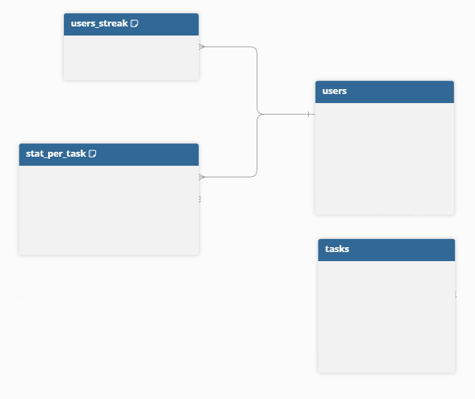
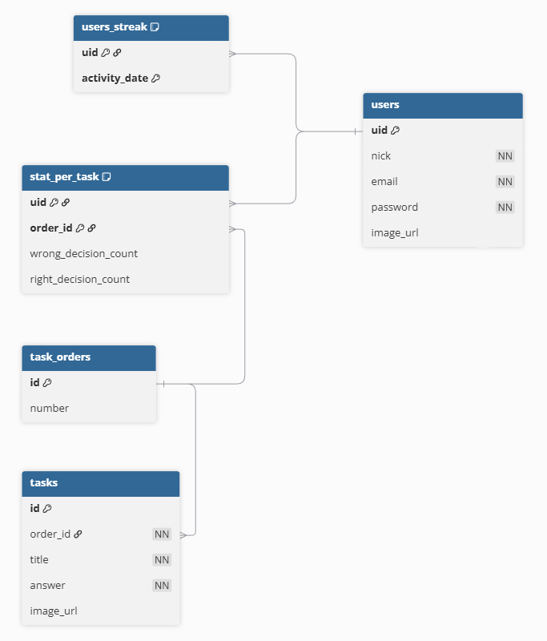
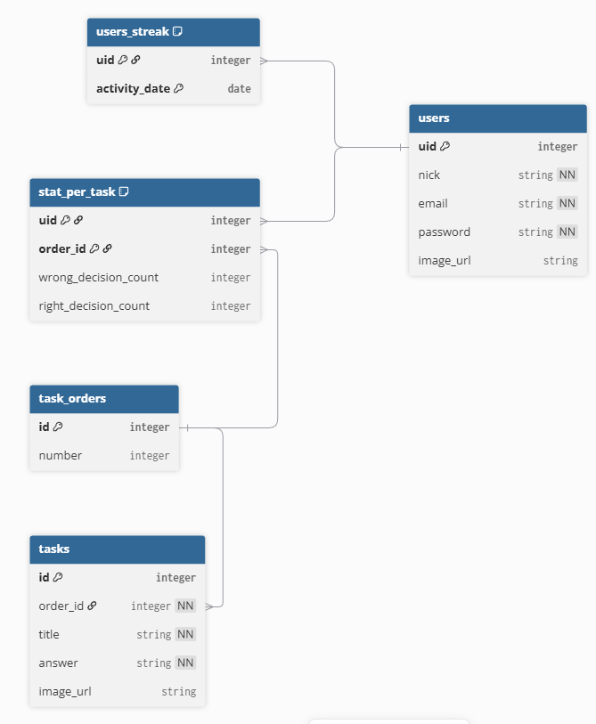

# Концептуальный уровень

## Примечания:

В users основная информация о пользователе, в users_streak - информация об активности пользователя, в stat_per_task - статистика решения задач для пользователя. Нет смысла хранить эти данные в users, так как таблица будет иметь слишком много полей. Кроме того, основная информация о пользователе почти никогда не оформляется, тогда как статистика и стрик могут обновляться каждый день (поведение схожее с паттерном P1 - горячие/холодные данные).

В tasks задачи и основная информация о них.

# Логический уровень

## Примечания:

Был применен паттерн L2 (справочник), так как колонка для tasks колонка order (по сути порядковый номер задачи в экзамене) имеет ограниченное количество значений. Так как количество номеров потенциально может измениться, либо задачи могут кардинально измениться по содержанию, то использование enum в этом случае было бы нецелесообразным.

# Физический уровень

## Описание в dbdiagram

[physic_level](code/dbdiagram.md)